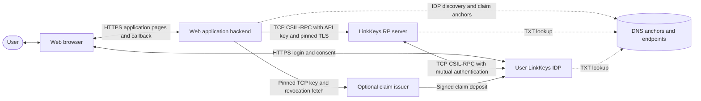
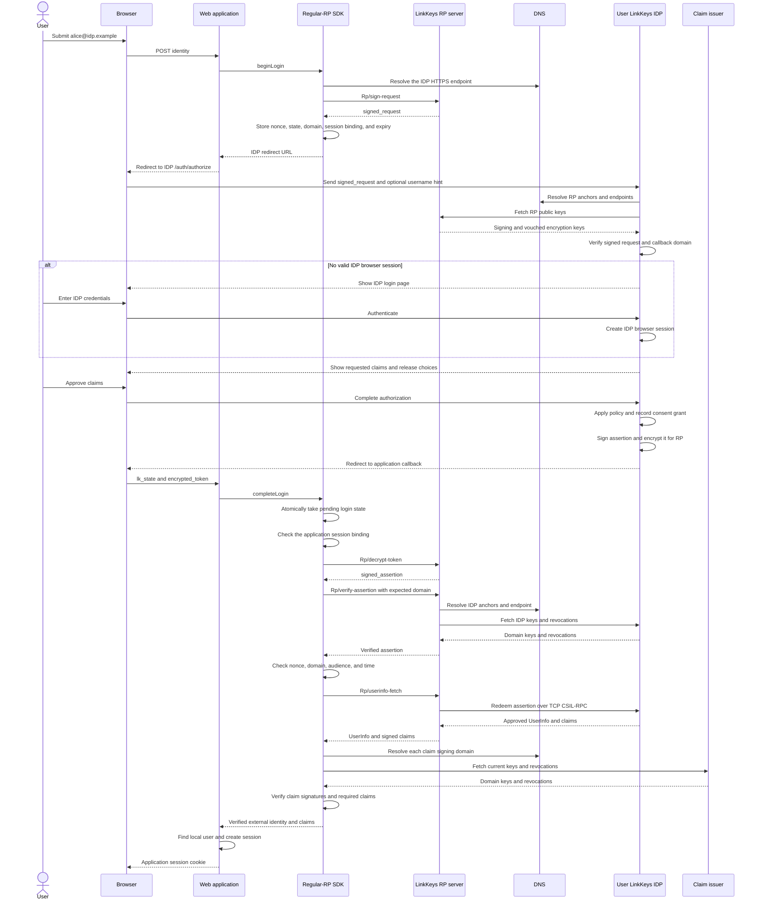
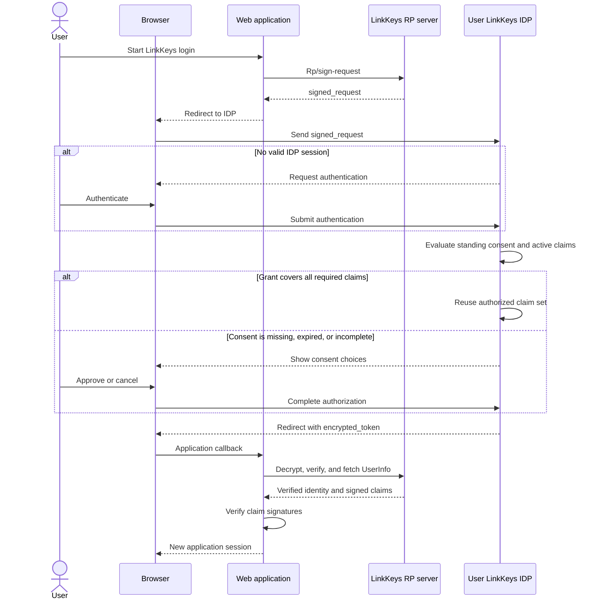
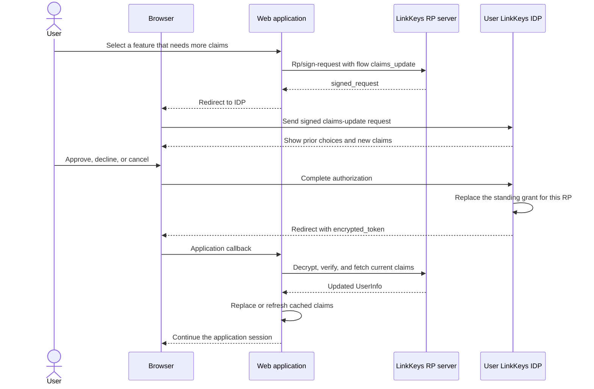
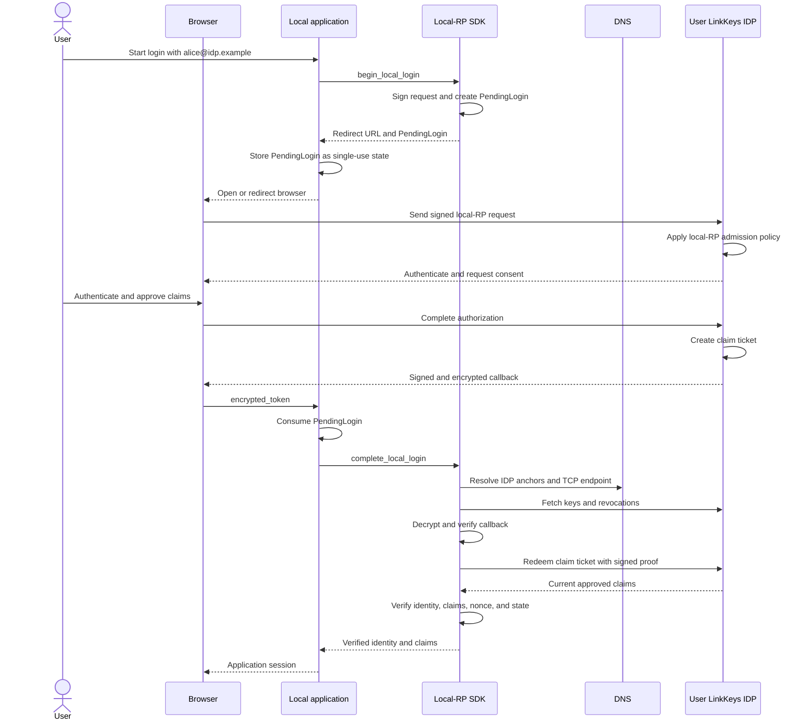

# LinkKeys authentication and claims flow

This document explains how a web application uses LinkKeys for authentication
and claims. It is an implementation guide. The documents in [`spec/`](spec/README.md)
define the normative protocol.

## Server roles

In this document, an RP server is a LinkKeys server that has the RP function
enabled. It can be a dedicated RP server, or it can be an IDP server that also
has the RP function enabled. The combined IDP and RP configuration is the
common configuration.

The diagrams show the RP and IDP as separate actors because the two roles have
different protocol tasks. One LinkKeys server can perform both roles.

## LinkKeys in one minute

A regular LinkKeys web login has these steps:

1. A user enters a LinkKeys login, such as `alice@idp.example`.
2. The web application stores single-use login state. This state includes a
   new nonce, the expected identity domain, and a binding to the application
   browser session.
3. The web application asks its LinkKeys relying-party server to sign an
   authentication request.
4. The application redirects the browser to the user's LinkKeys identity
   provider.
5. The identity provider authenticates the user. It applies domain release
   policy and asks the user for consent when consent is necessary.
6. The identity provider signs an assertion. It encrypts the assertion for the
   relying party and redirects the browser to the application callback.
7. The relying-party server decrypts and verifies the assertion. It fetches
   the approved claims directly from the identity provider.
8. The SDK verifies each claim with the current keys and revocations from all
   claim signing domains.
9. The web application maps `(user_id, domain)` to a local account. It then
   creates its own application session.

LinkKeys is not a JSON REST login API. Protocol messages use CBOR. Browser
interactions use HTTPS. Server-to-server operations use TCP CSIL-RPC.

## Actors and responsibilities

| Actor | Responsibility |
| --- | --- |
| User and browser | Select an identity domain, authenticate, review consent, and carry signed or encrypted redirect data. |
| Web application | Store pending login state, map LinkKeys identities to local users, enforce required claims, and manage application sessions. |
| LinkKeys RP server | Hold the RP domain keys, sign requests, decrypt callbacks, verify assertions, and fetch user information. |
| User's LinkKeys IDP | Authenticate users, store claims, apply release policy, record consent, and issue assertions. |
| DNS | Publish domain trust anchors and LinkKeys service endpoints. |
| Claim issuer | Sign a claim when a third party attests a fact about the user. This actor is optional. |

The browser is a carrier. It does not hold an RP private key or an RP API key.

## System context

## Select an integration model

LinkKeys has two relying-party models.

| Question | Regular RP | Local RP |
| --- | --- | --- |
| Intended application | A public web application with a domain | A desktop, LAN, or self-hosted application without public DNS |
| RP identity | A DNS-anchored domain | A fingerprint of a local signing key |
| Key location | A LinkKeys RP server | Application secret storage |
| Application connection | TCP CSIL-RPC to its RP server | Local SDK calls and direct TCP CSIL-RPC to the IDP |
| Admission | Other domains verify the RP through DNS anchors | The user's domain applies its local-RP policy and can require administrator approval |
| Browser callback | HTTPS URL under the RP domain | HTTP or HTTPS callback with a signed and encrypted payload |

Use the regular RP model for a normal public website. Use the
[local-RP application guide](local-rp-app-developer-guide.md) when the
application cannot publish a domain identity.

## Regular-RP API map

The application backend calls the `Rp` CSIL service on its LinkKeys RP server.
The application must use an API key that has the `api_access` relation.

| Step | Caller | Operation | Result |
| --- | --- | --- | --- |
| Begin | Application to RP server | `Rp/sign-request` | A URL-encoded `SignedAuthRequest` |
| Authorize | Browser to IDP | `GET /auth/authorize?signed_request=...` | IDP login and consent flow |
| Callback | IDP through browser to application | `GET <callback>?encrypted_token=...` | An encrypted signed assertion |
| Open | Application to RP server | `Rp/decrypt-token` | A `SignedIdentityAssertion` |
| Verify | Application to RP server | `Rp/verify-assertion` | A verified `IdentityAssertion` |
| Claims | Application to RP server | `Rp/userinfo-fetch` | A `UserInfo` record with approved claims |
| Session | Application-local operation | Application session creation | A logged-in application user |

The complete TypeScript SDK is in
[`sdks/regular-rp/typescript/`](../sdks/regular-rp/typescript/README.md). It
provides these application operations:

| Location | Operation | Purpose |
| --- | --- | --- |
| Browser | `startLinkKeysLogin` | Send an identity to the application backend and follow the returned redirect. |
| Backend | `beginLogin` | Discover the IDP, sign the request, and save pending login state. |
| Backend | `completeLogin` | Consume pending state, verify the login and claims, and return the external identity. |

The SDK includes the pinned TCP CSIL-RPC transport. Keep the RP API key in the
backend. Other language directories contain generated bindings only. A binding
is not a complete application SDK.

## First web login with consent

The application must consume pending login state before it accepts the
callback. It must use the same application browser session for both SDK calls.
A second callback for the same state must fail.

## Returning login and standing consent

An IDP can complete a normal login without a new consent screen when a valid
standing grant covers the request. Every required claim must still be approved
and available. The first login always shows the claims that the IDP will send.
This rule also applies when an administrator requires the release. A new forced
claim opens the disclosure screen once before it can enter the standing grant.
An explicit claims-update request does not use this shortcut.

The server exposes the standing-consent result through the browser authorization
service and the authorize validation API. An IDP UI can use that result to skip
a repeated consent screen. It must show the normal consent screen when silent
completion fails.

## Request more claims after login

The application can request more claims later. It sets the signed flow context
to `claims_update`. This flow opens consent again and can include a reason for
the request.

The application must not treat an old claim cache as new consent. It must use
the authorized claim set in the new assertion.

## Local-RP comparison

The local-RP SDK owns the protocol verification steps. The application still
owns pending state, local users, and sessions.

## What each signed object protects

### Authentication request

The RP signs an `AuthRequest`. It binds these values:

- RP domain;
- callback URL;
- nonce;
- timestamp;
- requested claims;
- minimum authentication factor count, when present;
- login or claims-update context, when present.

The IDP validates this request before it shows a credential form. The optional
`username` URL parameter is only a form hint. It is not identity evidence.

### Identity assertion

The IDP signs an `IdentityAssertion`. It binds these values:

- user ID;
- identity domain;
- RP audience;
- request nonce;
- issue and expiry times;
- claim types that this login can release.

An empty `authorized_claims` list releases no claims. The optional display name
in the assertion is a convenience value. It is not a signed claim that grants
application access.

### Claim

A claim contains a type, value, subject user ID, dates, and one or more
signatures. Each signature names its signing domain. A signature proves which
domain attested the claim. It does not tell the application to trust that
domain.

The application must define its own trust policy. For example, it can require
an `age_over_21` claim from one of a configured set of issuers.

## Claims and consent

An RP can request required and optional claims. The IDP combines four inputs:

1. the RP request;
2. user consent;
3. the user's active claim values;
4. the IDP domain's release rules.

A `forced_deny` rule prevents release. A `forced_allow` rule requires release
when an active value exists. User-controlled claims follow the user's choice.
The resulting claim-type list is stored in the assertion and limits the
`UserInfo` response.

A required claim states that the application cannot provide the requested
experience without that claim. The user can cancel the login instead of
sharing it. The application must also check that every required claim is in the
verified SDK result.

Claims can expire, be replaced, or be revoked. Store only the claims that the
application needs. Keep their dates and signer information. Refresh them when
the application needs current data.

## Application integration checklist

- Parse the identity input before the redirect. Use the domain for discovery.
- Use the optional local username only as an IDP form hint.
- Create a new nonce for each login.
- Store the nonce and expected domain in server-side or integrity-protected
  pending state.
- Bind pending state to the application browser session that started login.
- Consume pending state once, before callback verification.
- Use a callback host in the RP domain or one of its subdomains.
- Keep the RP API key in a secret store.
- Pin the application-to-RP connection to configured LinkKeys fingerprints.
- Check assertion verification, audience, nonce, identity domain, and expiry.
- Use `(user_id, domain)` as the external identity key.
- Enforce required claims after `userinfo-fetch`.
- Decide which claim signing domains the application trusts.
- Create, refresh, and revoke the application's own sessions.
- Do not log API keys, passwords, tokens, pending state, or claim values.

## Separate state

These records have different purposes and lifetimes:

| State | Owner | Purpose |
| --- | --- | --- |
| Pending login | Web application | Bind one callback to one login attempt. |
| IDP browser session | User's IDP | Avoid repeated IDP authentication while policy permits it. |
| Consent grant | User's IDP | Record the claim types approved for one user and one RP. |
| Identity assertion | User's IDP and RP | Prove one authentication result to one audience. |
| Application session | Web application | Keep the user logged in to that application. |
| Cached claims | Web application | Support application features that need claim data. |

Application logout ends the application session. It does not automatically end
the IDP browser session or revoke the IDP consent grant.

## Common failures

| Failure | Required action |
| --- | --- |
| Pending login is missing or already used | Start a new login. |
| Signed request is expired or already used | Start a new login. |
| RP key fetch or pin check fails | Check the RP DNS records, endpoint, and pin history. |
| RP encryption key is not trusted | Re-vouch the RP encryption key and retry with a new login request. |
| IDP cannot meet the requested factor count | Change the request or use an IDP that can meet it. |
| A required claim is unavailable or not released | Cancel or deny the application login. Tell the user which claim is needed. |
| Assertion domain, audience, nonce, expiry, or signature is wrong | Reject the callback. Do not create a session. |
| User-info retrieval fails | Do not create a claims-dependent session. Retry only with valid pending state. |

## Next reading

- [Regular-RP SDKs and generated bindings](../sdks/regular-rp/README.md)
- [Deploy a LinkKeys RP server](DEPLOYING-RP.md)
- [Protocol specification](spec/README.md)
- [Identity assertions](spec/assertions.md)
- [Claims](spec/claims.md)
- [Trust anchors](spec/trust-and-anchors.md)
- [Claim policy and consent](claim-policy-and-consent.md)
- [Claim trust and verification](claim-trust-verification.md)
- [Local-RP application guide](local-rp-app-developer-guide.md)
